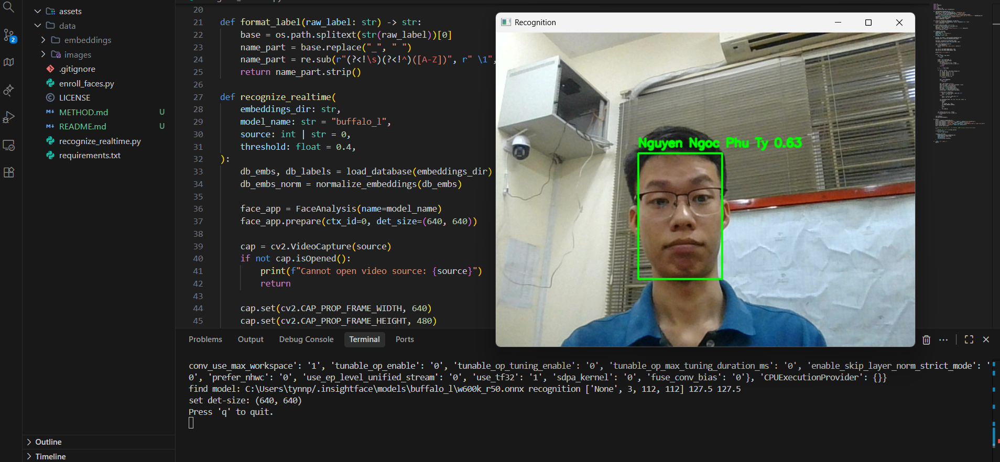

# Hệ thống nhận diện khuôn mặt realtime

Dự án này là một repo cơ bản minh hoạ hệ thống nhận diện khuôn mặt realtime dùng InsightFace (`FaceAnalysis`) để phát hiện và trích xuất đặc trưng khuôn mặt, có thể chạy trên GPU hoặc CPU (Windows).



_Hình minh hoạ nhận diện realtime._

## Tính năng chính

- Nhận diện khuôn mặt realtime từ webcam hoặc file video.
- Sử dụng InsightFace (`FaceAnalysis`) để phát hiện và trích xuất đặc trưng khuôn mặt.
- Có thể chạy trên GPU (onnxruntime-gpu) hoặc CPU (tự động fallback nếu không có GPU).
- Pipeline enroll (đăng ký) khuôn mặt từ thư mục ảnh và lưu database embeddings.
- Tăng tốc tìm kiếm gần nhất bằng FAISS (tuỳ chọn, nếu cài đặt).

## Cấu trúc thư mục

- `enroll_faces.py`  
  Tạo database embeddings từ thư mục ảnh `data/images`.

- `recognize_realtime.py`  
  Chạy nhận diện khuôn mặt realtime dùng webcam hoặc video.

- `faiss_index.py`  
  Module tuỳ chọn dùng FAISS để tăng tốc tìm kiếm embedding (nếu FAISS được cài, nếu không sẽ tự động fallback về NumPy).

- `requirements.txt`  
  Danh sách các thư viện Python cần cài.

- `data/images/`  
  Chứa ảnh gốc của từng người, mỗi người một thư mục con.

- `data/embeddings/`  
  Chứa `embeddings.npy` và `labels.npy` được tạo bởi `enroll_faces.py`.

- `README.md`  
  Mô tả dự án, phương pháp và hướng dẫn sử dụng.
 
## Yêu cầu hệ thống

- Python 3.10 trở lên.
- (Khuyến nghị) GPU NVIDIA với CUDA nếu muốn realtime mượt.
- Nếu không có GPU phù hợp, InsightFace vẫn có thể chạy trên CPU (chậm hơn).

## Cài đặt

1. Tạo và kích hoạt môi trường ảo (khuyến nghị):

```bash
python -m venv .venv
.venv\Scripts\activate
```

Hoặc dùng Conda:

```bash
conda create -n RFR python=3.10
conda activate RFR
```

2. Cài thư viện Python:

```bash
pip install -r requirements.txt
```

3. (Tuỳ chọn) Đảm bảo driver GPU/CUDA tương thích nếu bạn muốn InsightFace chạy trên GPU thông qua `onnxruntime-gpu`. Nếu không có GPU, thư viện sẽ tự động dùng CPU.

## Chuẩn bị dữ liệu ảnh

Cấu trúc thư mục ảnh mặc định:

```text
data/
  images/
    <folder_nguoi_1>/
      img1.jpg
      img2.jpg
      ...
    <folder_nguoi_2>/
      img1.jpg
      ...
```

Mỗi người:

- Một thư mục con trong `data/images`.
- Bên trong là các ảnh khuôn mặt (jpg/jpeg/png).

Khi enroll, script sẽ dùng trực tiếp tên thư mục làm nhãn hiển thị, ví dụ: `NguyenNgocPhuTy`.

Những tên này sẽ được lưu vào `labels.npy`.

## Tạo database embeddings (enroll)

Chạy:

```bash
python enroll_faces.py \
  --images_dir data/images \
  --output_dir data/embeddings \
  --model_name buffalo_l
```

Script sẽ:

- Duyệt từng thư mục người trong `images_dir`.
- Tìm mặt bằng InsightFace, trích xuất embedding cho từng ảnh.
- Lấy trung bình embedding của mỗi người.
- Lưu:
  - `embeddings.npy`: mảng (N, D) các vector embedding float32.
  - `labels.npy`: mảng (N,) tên người đã được chuẩn hoá.

## Nhận diện khuôn mặt realtime

Chạy:

```bash
python recognize_realtime.py \
  --embeddings_dir data/embeddings \
  --model_name buffalo_l \
  --source 0 \
  --threshold 0.4
```

Giải thích một số tham số:

- `--embeddings_dir`  
  Thư mục chứa `embeddings.npy` và `labels.npy`.

- `--model_name`  
  Tên model InsightFace (`buffalo_l`, v.v.). Giữ nguyên mặc định nếu bạn không chắc nên chọn model nào.

- `--source`  
  `0` là webcam mặc định. Có thể thay bằng `1`, `2`... hoặc đường dẫn tới file video.

- `--threshold`  
  Ngưỡng độ tương đồng để quyết định Unknown hay xác định được. Giá trị cao hơn -> ít nhầm hơn nhưng khó nhận hơn.

### Lưu ý về GPU

- InsightFace (`FaceAnalysis`) trong code mặc định dùng `ctx_id=0`:
  - Nếu hệ thống có GPU + CUDA + `onnxruntime-gpu` phù hợp, model sẽ chạy trên GPU.
  - Nếu không có GPU, onnxruntime sẽ tự động fallback sang CPU (chậm hơn nhưng vẫn chạy được).
- Nếu bạn muốn **ép chạy CPU**, có thể sửa `ctx_id=0` thành `ctx_id=-1` trong `enroll_faces.py` và `recognize_realtime.py`.

### Tăng tốc tìm kiếm bằng FAISS (tuỳ chọn)

- Mặc định, hệ thống sử dụng NumPy để tính độ tương đồng giữa embedding khuôn mặt hiện tại và database (`db_embs_norm @ emb_norm`). Cách này đơn giản và đủ nhanh nếu số lượng người (N) còn ít.
- Khi N lớn (hàng ngàn người trở lên), bạn có thể cài thêm FAISS để tăng tốc tìm kiếm gần nhất.

#### Cài đặt FAISS (gợi ý)

- Nếu dùng Conda (khuyến nghị):

```bash
conda install -c pytorch faiss-cpu
# hoặc (chỉ khi đã thiết lập CUDA phù hợp)
# conda install -c pytorch faiss-gpu
```

- Nếu dùng pip (tuỳ môi trường):

```bash
pip install faiss-cpu
```

> Lưu ý: tuỳ phiên bản Python/Windows mà gói `faiss-cpu` có thể không có sẵn wheel. Khi đó dùng Conda thường ổn định hơn.

#### Cách hoạt động trong code

- Logic FAISS được tách riêng trong file `faiss_index.py`.
- Khi chạy `recognize_realtime.py`:
  - Nếu import FAISS thành công và khởi tạo index OK, chương trình sẽ in log dạng: `FAISS enabled with <N> embeddings.` và dùng FAISS để tìm hàng xóm gần nhất.
  - Nếu không cài FAISS hoặc khởi tạo lỗi, chương trình sẽ in thông báo lỗi và **tự động fallback về NumPy search**, nên vẫn hoạt động bình thường (chỉ là chậm hơn khi database rất lớn).

## Phương pháp nhận diện khuôn mặt

Phương pháp (pipeline, chuẩn bị dữ liệu, chuẩn hoá nhãn và cách xử lý từng frame) được mô tả chi tiết trong file `METHOD.md`. Hãy xem `METHOD.md` nếu bạn muốn hiểu rõ hơn về mặt thuật toán.

## Giấy phép

Dự án được phân phối dưới MIT License. Xem chi tiết trong file `LICENSE` của repository.